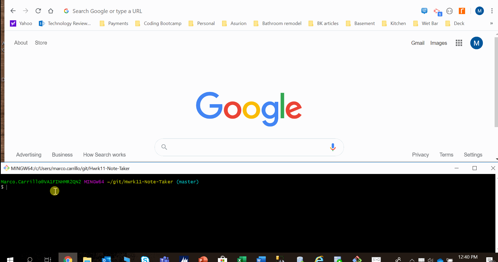

# Purpose of the application

The server application has been designed to be the server-side counterpart for the web-based note-taking application.

It serves both request for static files and requests for API-based data requests.

Data is stored in a JSON file that is saved on the server side.

Ultimately, the server application will enable the web-based note-taking application to 1) Create new notes, and 2) Eliminate (erase) existing notes.

## Server-side functionality

The server will actively listen for any requests made through port 8080, as requested by the web-based note-taking application.

The server-side first objective is to serve static file requests from the client-side.  To do that, there are four static routes that it will be actively listening for

1. "/notes":  Upon reception of a request through this route, the server will provide the "../public/notes.html" file to the client. 
2. "/assets/css/styles.css":  Upon reception of a request through this route, the server will send the "../public/assets/css/styles.css" file.
3. "/assets/js/index.js":  Upon reception of a request through this route, the server will send the "../public/assets/js/index.js" file.
4. "*":  This is the "catch-all" route.  Any request made through any other route from the prior three explained above will result in server sending file "../public/index.html"

The second objective, is to send data whenever an API route request is received as follows:

1. "GET /api/notes":  Upon reception of a request through this route, the server will respond with an array of objects, which will contain all of the notes stored in the file "../db/db.json".
2. "POST /api/notes":  Upon reception of a request through this route, the server will use the data sent with an object containing the title and description of a new note, will add a unique hexadecimal 12-character-long key, and will append it to the existing JSON file.  It will respond with a code of 200 (success).
3. "DELETE /api/notes":  Upon reception of a request through this route, the server will use the unique ID that the application is sending and will look for such ID in the JSON file, and will eliminate it.  It will respond with a code of 200 (success).

##  Complete application functionality

The application will enable the user to do two main activities:

1.  Enter a note
2.  Delete an existing note

## File structure

This application uses well defined paths to store all of its components.  Here is an overview of the data file structure, and where all of the application components are stored.

ROOT | readme.MD (explanation)
     | package.json (installation)
     | .gitignore (exclude files)
     | server.js (main server code)
     |
     |-------| ROUTES | htmlRoutes.js (server code for handling htmlRoutes)
     |                | apiRoutes.js (server code for handling apiRoutes)
     |
     |-------| DB | db.json (json file to store notes)
     |
     |-------| Gifs | app-run.gif (gif demo prior to be deployed to Heroku)
     |
     |-------| Public | index.html (client-side html mail code)
                      | notes.html (client-side html notes code)
                      |
                      |-----assets |--- CSS | styles.css (contains styles for notes.html)
                                   |
                                   |--- JS  | index.js (main JS script file called by notes.html)
                                
##  Starting the application

The application has been hosted on Heroku.  To start it, start a browser and enter the following command line.

https://note-taker-app-001.herokuapp.com/

this should allow 1) the server side application to start, and 2) the client-side to provide all needed functionality.
